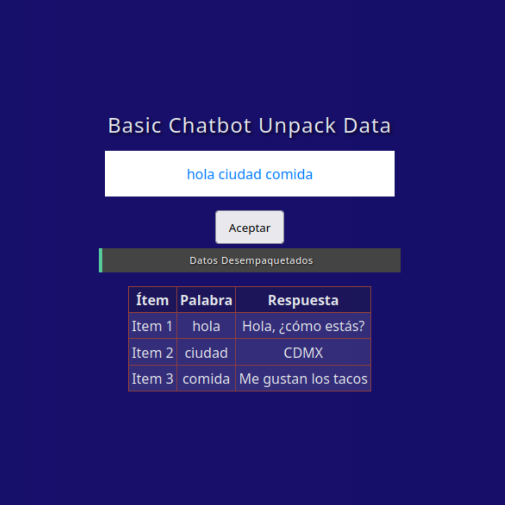

# Basic Chatbot Data Unpacker

This project is a simple chatbot that unpacks text data and provides predefined responses based on the user's input. It utilizes Flask for the backend and React for the frontend.

**Picture:** *Picture: The image shows how the system unpacks text data and processes responses.*

## How it works
1. **User Input**: The user types in a query, which gets sent to the Flask backend via a POST request.
2. **Data Unpacking**: The backend splits the input text into individual words and processes them.
3. **Response Lookup**: Each word is checked against a predefined dictionary of responses, returning the appropriate message.
4. **Display**: The frontend receives the unpacked words and their corresponding responses, displaying them in a table.
